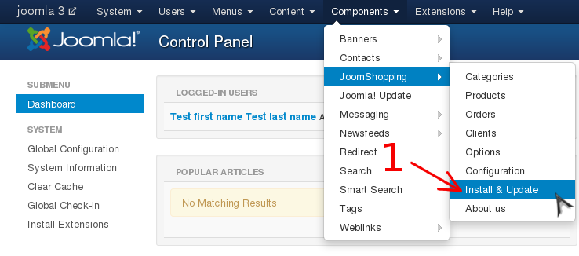
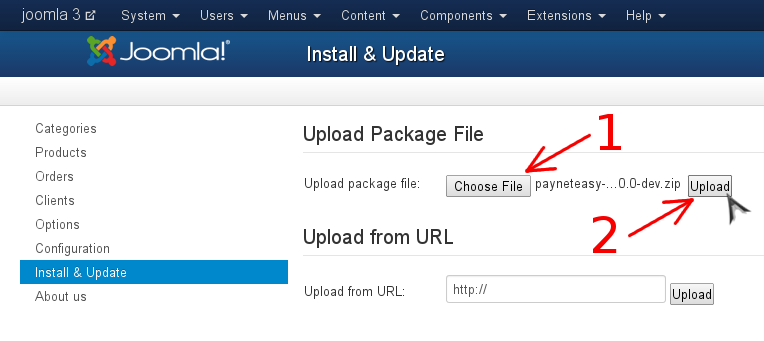

# Установка плагина

1. [Получите пакет с плагином](../README.md#get_package)
2. Перейдите в панель администрирования Joomla
3. Перейдите в менеджер расширений JoomShopping (стрелка #1)

    
4. Установите пакет с плагином
    1. Откройте диалог поиска файла (стрелка #1)
    2. Найдите и выберите пакет с плагином
    3. Загрузите и установите пакет с плагином (стрелка #2)

    
