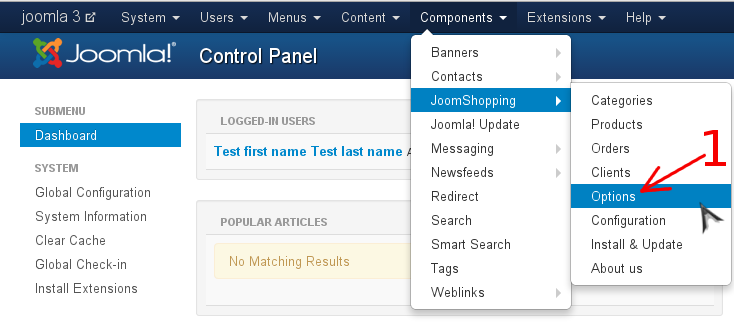
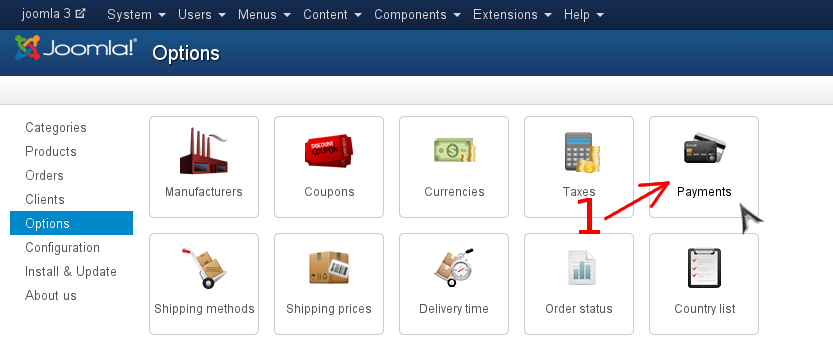

# Настройка плагина

1. Перейдите в панель администрирования Joomla
2. Перейдите в панель "Options" JoomShopping (стрелка #1)

    
3. Перейдите к списку методов оплаты (стрелка #1)

    
4. Нажмите на кнопку "Edit" (стрелка #1)

    
5. Заполните настройки плагина
    1. Переключите форму на вкладку "Config" (стрелка #1)
    2. Заполните форму для настроек платежного метода
    4. Сохраните платежный метод и закройте форму (стрелка #2)

    
6. Опубликуйте платежный метод
    1. Выберите платежный метод в списке (стрелка #1)
    2. Опубликуйте платежный метод (стрелка #2)

    
