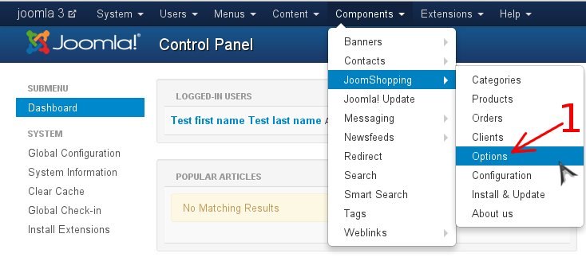
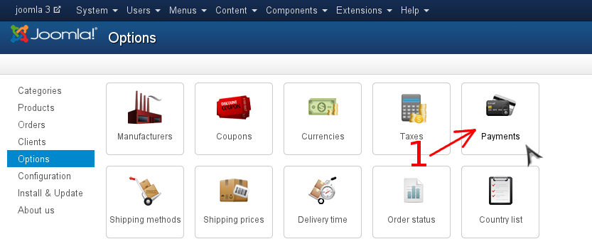
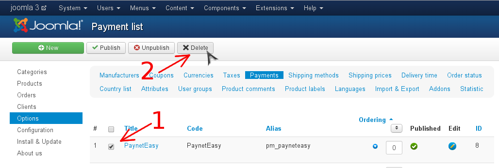

# Удаление плагина

1. Перейдите в панель администрирования Joomla
2. Перейдите в панель "Options" JoomShopping (стрелка #1)

    
3. Перейдите к списку методов оплаты (стрелка #1)

    
4. Удалите платежный метод
    1. Выберите платежный метод в списке (стрелка #1)
    2. Удалите платежный метод (стрелка #2)

    
5. Для полного удаления плагина необходимо удалить некоторые папки и файлы. Пути к ним даны относительно корневой папки Joomla. Список файлов и папок для удаления:
    * `components/vendor`
    * `components/com_jshopping/payments/pm_payneteasy_abstract`
    * `components/com_jshopping/payments/pm_payneteasy_sale`
    * `components/com_jshopping/payments/pm_payneteasy_saleform`
